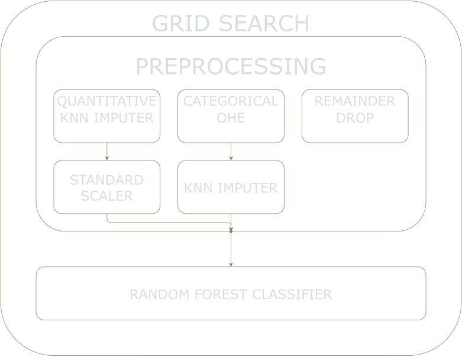

# Mini-project IV

## Project/Goals
For this project, I wanted to focus on building, grid-searching, and testing an entire pipeline along with integrating Docker into my AWS instance.

## Hypothesis
I will be testing two main hypotheses:
1. That gender plays a significant role in the determination of a bank loan
2. That credit score plays a significant role in the determination of a bank loan

## Process

### EDA

[EDA Notebook](notebooks/DateExploration.ipynb)

After giving the data an intial look to get a first impression, I looked through the data to find NaN values, audit the entries, and examined outliers. Looking at the histograms of each feature I found that a number of features were heavily skewed which may introduce bias into our dataset. Also, the applicant and coapplicant income are positively skewed so we will need to take a log transformation.

Looking at the correlation matrix of our feature we see a positive correlation between credit history and positive loan approval. There is a small difference with gender but it isn't immediately clear from the plot how much of an influence it has.

### Proof of Concept Pipeline
[Simple Model Notebook](notebooks/Simple_Model.ipynb)

After preforming my EDA, I created an extremely simple pipeline that allowed me to "fail fast and fail early." I wanted to make sure I had a proof of concept regarding pipelines and flask before moving on with the project. To do this, I did the following:

  1. Dropped all non-quantitative features from the dataset
  2. Dropped all NaN rows
  3. Created, fit, and predicted a pipeline: SimpleScaler -> RandomForestClassifier -> GridSearchCV (only searching between two params)
  4. Saved resulting model as a pickle file
  5. Uploaded the pickle along with a basic flask API to AWS
  
Having created this basic pipeline, I felt ready to move on to the project proper.

### Pipeline Building: Cleaning

To build the pipeline, I created a custom class. This allows for a clean main.py and to streamline my workflow. I integrated KNNImputer and OneHotEncoder into my pipeline to help fill in missing values, change categorical variables into dummy variables, and to allow GridSearch to find the optimal imputer in future versions. 

### Pipeline Building: Modelling

Have built a pipeline to clean and encode the data I then looked to include the modelling within this pipeline. I wanted to take full advantage of the pipeline and Gridsearches ability to search with the entire pipeline. So, I placed a placeholder model (a default randomforest) to be replaced by the grid search with either a random forest, logistic regression, or kneighbours. I then ran a gridsearch to find the optimal hyperparamters and model.

### Deployment
Have found my model, I saved it as a pickle which, along with a flask API, I uploaded to an EC2 AWS instance. Afterwards, I looked to place them within a Docker container. I was able to get this to work with middling success.

### Testing
Using kfold testing (K = 5) my model was accurate at predicting loan approval to ~75%.

My model was able to accurately find true positives but had issues with false negatives. With this in mind, I believe this model would work best for a bankwith a more conservative outlook towards handing out loans. One that valued handing out fewer but safer loans against a greater number of riskier ones.

## Challanges and Future Goals
I had wanted to be able to use grid search to also look through different imputers but had issues getting that functionality to work. I also struggled with Docker finding some success but not feeling confident in my deployment. I would like to fix this in the future.